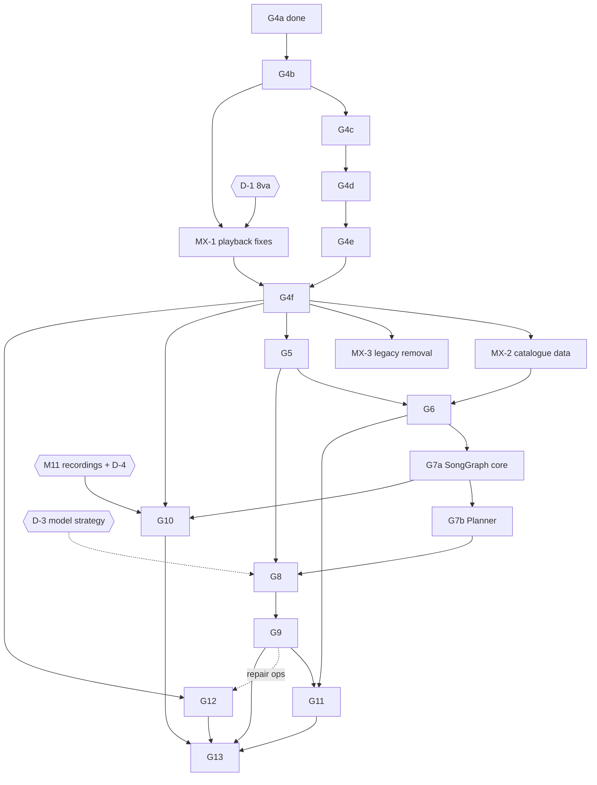

# PPP — Master Roadmap

The operational roadmap for everything after G4a: order, dependencies, gates, and what happens next.

| | |
| --- | --- |
| Owner | The **Lead / Orchestrator** session. Implementers, reviewers and fixers read it. Only the Lead edits it. |
| Updated | 2026-09-26 — twelfth edition (Lead): **G4f-1 CLOSED** (PR #28 `2c6d108`); current: G4f-2 (M-H2, flip) |
| Base | `origin/main` = `2c6d108` (G4f-1, PR #28) plus the docs closeout |
| Active | **G4f-2** — M-H2 (pass/fail human review), then the flip (§14, §15). |
| Lead worktree | `D:/PPP-lead`, branch `lead-roadmap`. The Lead writes docs only, never in an implementer's worktree. |
| How this relates to other docs | `docs/CURRENT_STATE.md` says what is true now, with measurements. `docs/DECISIONS.md` says why. `docs/GOALS/Gxx_*.md` is the contract for one Goal: design, acceptance and implementation record. **This document says in what order, behind which gates, and what comes next.** It does not repeat the goal specs. On detail, the spec wins. On sequencing, this document wins. |

## Contents

1. [Product north star](#1-product-north-star)
2. [Current architecture](#2-current-architecture)
3. [Completed Goals](#3-completed-goals)
4. [Deferred work](#4-deferred-work)
5. [Remaining Goals](#5-remaining-goals)
6. [Dependency graph](#6-dependency-graph)
7. [Recommended implementation order](#7-recommended-implementation-order)
8. [Phase boundaries](#8-phase-boundaries)
9. [Acceptance gates](#9-acceptance-gates)
10. [Human-review gates](#10-human-review-gates)
11. [Automation / test strategy](#11-automation--test-strategy)
12. [AI / model milestones](#12-ai--model-milestones)
13. [Technical debt that blocks later Goals](#13-technical-debt-that-blocks-later-goals)
14. [Current task](#14-current-task)
15. [Next task](#15-next-task)
16. [Stop conditions](#16-stop-conditions)
17. [Definition of final product completion](#17-definition-of-final-product-completion)
18. [Decisions that need the user](#18-decisions-that-need-the-user)
19. [Change log](#19-change-log)

---

## 1. Product north star

PPP turns music a person cares about into a piano score they can actually learn, and then helps them learn it.

```
original audio │ symbolic file │ printed score
   → musical understanding            SongGraph (what the piece is)
   → arrangement planning             for which player, what to keep, which style
   → arrangement realization          notes → ScoreGraph (what is played and notated)
   → professional notation            engraving: screen + print
   → playability + difficulty         is it playable, how hard, where
   → adaptive practice                practise, measure, simplify or advance
```

**Quality bar.**
- A piano teacher would hand the score to a student without fixing it. This is the absolute axis of the G3 and G4 human reviews.
- The app never contradicts itself: **what is drawn = what is played = what is judged.**

**Principles (binding on every Goal).**

1. **정답이 명확한 것은 코드로, 음악적으로 애매한 것은 AI로.**
   - Clear answers are written as code: notation legality, geometry, collision, validation, playback semantics, timing arithmetic, physical reach and hand constraints.
   - Musically ambiguous questions go to learned models: arrangement choices, style, how difficulty factors weigh, which reading is more musical, audio perception.
   - **The AI proposes, deterministic code verifies, and the ScoreGraph records provenance** (`inferred`, `generated`, `repaired` — all already in the schema, `scoregraph/schema.js:51`).
2. **ScoreGraph is the only notation truth.** Everything else is a projection or a cache (G1-D1..D12, G4-U1).
3. **SongGraph understands; ScoreGraph states.** SongGraph points into a ScoreGraph by ID and `ScoreSpan`, never the reverse, and never copies notes (G1-D11, G01 §10).
4. **Boundaries move by strangler**: shadow → A/B → flip behind an explicit switch, and the old path is kept for one release.
   - Writers never fall back silently (G1-D13).
   - Screens fall back per song, and the fallback is counted (G04 §16.7).
5. **Measure before and after.** Every change reports its effect on a committed benchmark. People are asked only at milestones.
6. **Judge each stage on clean input.** Upstream errors are reported separately (`CLEAN_INPUT` / `UPSTREAM_ERROR`), never excluded after the fact (A36 lesson, G3-U10).
7. No copyrighted material in the repository. Hold-out cases are never inspected or reported one by one.

---

## 2. Current architecture

At `a0bc2ea`. The detailed structure is in `docs/ARCHITECTURE.md`.

```
 producers                                   canonical                     consumers (what they read today)
 MusicXML/MXL/MIDI import (G2) ───────────►                                 renderer ──────── legacy Score  → G4 moves it to the graph
 recording → toMusicXml → buildGraph (G1) ─►  ScoreGraph  ── toScore ──►   playback, practice, follow,
 recording/rewrite → parseMusicXML(xml) ───►  (scoregraph/)                  Coach, Fingering ── legacy Score
 OMR → parseMusicXML + PdfLayer.apply ─────►   + IndexedDB cache (G4a)     arrangers (3 engines) ── legacy Score / wire JSON
 arrangers → parseMusicXML(xml) ───────────►   + engrave/ plan + ledger    MusicXML export ────── graph (G1)
                                               (no layout yet)             G0 benchmark ───────── MusicXML artifact
 SongGraph: design only (G01 §10), no code.
```

**Strangler stages** (G01 §15.2), with owners **reassigned by this roadmap** where the old owner lapsed:

| Stage | What | Status | Owner now |
| --- | --- | --- | --- |
| S0–S2 | Library, corpus round trip, writer goes through the graph | done (G1) | – |
| S3 | App import goes through the graph | done (G2) | – |
| S4 | App-made XML stops being re-parsed with `parseMusicXML` | **no owner.** G01 gave it to G2–G3; G2 and G3 both excluded it. | Split by producer: **arrangement → G8**, **recording/rewrite → G10**, **OMR → G12** |
| S5-render | The renderer reads the graph | G4a done (source, plan, ledger); G4b–G4f remain | G4 |
| S5-play | Playback, practice judging, follow and Coach read the graph | not started | **G11a** (the only Goal that needs it); two playback bugs go earlier in MX-1 |
| S6 | Arrangement input and output on the graph | not started | G8 |
| S7 | SongGraph and planner | not started | G7 (drums: not scheduled, §5.13) |
| S8 | Remove `parseMusicXML`, `buildXml`, `packScore`, the legacy renderer | not started | staged: the switches in MX-3 after G4f; the legacy renderer one release after the G4f flip; `packScore` and the legacy Score in G13 |

**What already exists as legacy code** (surveyed 2026-09-25 at `a0bc2ea`). Later Goals are migrations and upgrades of these, not greenfield:

| Capability | Legacy code | Reads | Measured? |
| --- | --- | --- | --- |
| Fingering | `Fingering` (App 8303–8769): a Parncutt span table plus keyboard-distance DP; the output feeds only the on-keyboard hand guide | Score | 17 exact cases in `tests/fingering.test.js` (browser, not in CI). No corpus metric. The path cost is discarded, so it produces no playability output. |
| Hand split | `audio-score.js` 840–899 (recordings); `scoregraph/pro-staff.js` (G3, off) | heard notes / graph | G0 hands gate |
| Difficulty | `Score.deriveSections` (App 3658) fixed 8-bar chunks with a weighted heuristic; `Coach.structural` (App 7958) | Score | nothing measures accuracy |
| Arrangement | browser `ScoreArranger` (App 8964); `arrange_score.py` (harmony Viterbi and voicing DP, music21 optional); `audio-score.js` `arrangeNotes` (subset of heard notes) | Score / wire JSON / heard notes | `tests/arranger_test.py` 3 tests, one golden. **No quality metric. No hand-span check** — LH voicings can exceed an octave. |
| LLM use | helper `/coach` (practice plans) and `/arrange` (level and style **parameters only**; "never invent, remove, transpose or name pitches") via Claude or Ollama | summaries | `coach.test.js` with a fake provider |
| Transcription | `transcribe.py` ensemble (TransKun V2, Kong, Aria-AMT) + Beat This + PM2S on the local helper; Basic Pitch and Onsets&Frames in the browser as fallback | audio | G0 bench (core 553, usable 18.1 %) |
| OMR | Audiveris or PDFtoMusic on the helper; `PdfLayer.apply` edits the Score | PDF | `omr-live` 4 cases, usable 0 % |
| Practice | `PerformanceEngine` (App 4924), `Learning` (5188), `Memory` (5691), `Coach` (7763), `course.js`, `lessons.js` | Score | browser suites only |
| Playback | `PianoScore` (App 2590); `Score.form` expands repeats and voltas only (no D.S., D.C. or Fine); pedal `change` = no lift | Score | `playback-scheduler.test.js` |
| Server | `server.js`: auth, progress blob, shares, helper proxy; Postgres or a JSON file. Songs are **not** synced, only progress. | – | browser suites |

---

## 3. Completed Goals

| Goal | Status | Merged | Later Goals reuse |
| --- | --- | --- | --- |
| G0 Quality Foundation | CLOSED | PR #1 `aff7080` | `tests/bench/`: `run.py run/check/ab/golden/mutation-check/update-baseline`, suites smoke/core/robust/full/replay-public/omr-live, the usable-score gates, hold-out rules, review scripts, CI `bench.yml` |
| G1 ScoreGraph | CLOSED | PR #2 `aa77d2e`, #3 `00081cc` | `scoregraph/`: schema, validator, canonical JSON, `time.js` (unroll, tempoMap, resolveSpan), `prov.js`, ops, MusicXML import/export, `sg-roundtrip`, SongGraph interface types (G01 §10.3) |
| G2 Score Import | CLOSED | PR #4 `cc0da79` (+#5, #6) | `scoregraph/import.js` (the one door), MIDI (`midi-file.js`, `midi-import.js`), `legacy-score.js` `toScore`/`compare`, schema v2, the written/sounding pitch layers (G2-D15) |
| G3 Score Intelligence | **PARTIAL / DEFERRED**, all off | PR #7 `c5474c2` (+#8) | `professionalize()` passes and critic (off), `meter-grid.js`, `pro-beam.js` `groups` (used by G4), reason-aware gates, blind human-review tooling (`run.py human-set`) |
| G4d-1b System marks and vertical spacing | CLOSED | PR #19 `a6e1a75` | `sysmarks.js`: dynamics, hairpins, pedal (change visible), ottava ("(8)" after a break), voltas, chord names, tempo (one line), rehearsal, jumps, words, lyrics; §15.3 vertical spacing; §15.4 courtesy signs; named metrics for A8 positions and hairpin extent; `plan/3`, `engr/5`; B9 0.32 |
| G4d-1a Curves and note marks | CLOSED | PR #17 `b4fe019` | `curves.js` (ties, slurs, glissandi, halves at system breaks), `marks.js` (one `place()` over skylines, `FAR_PLACEMENT`), articulations, ornaments, fermatas, fingering inside slurs (G4-L5), chord ties split relative to the chord (G4-L4), arpeggios, noteheads, cautionary accidentals, percussion; text-metrics table; `plan/2`, `engr/3` and a version guard |
| G4e Print and PDF | CLOSED | PR #26 `a33ccd3` | Print-only DP line-breaker (`engrave/breaks.js`), pagination that never splits a system, a title/composer/page-number area, print-only multi-measure rest merging, a dev-switch-gated print command; screen output byte-identical (`engr/6`, 236/236 SERIALIZATION_ONLY); a committed print regression-hash baseline added after review (G4-E8) |
| G4d-2 Page integration | CLOSED | PR #23 `16ce784` | `engrave/page.js`: the renderer in the page behind a dev-only switch (default `'legacy'`); `sync` touches only changed elements; §16.4 DOM contract; fallback to legacy with a counted warning; `server.js` hash-gated immutable caching; the M-H1 review tool. Verified byte-identical to base on a scripted default-renderer user session |
| G4c Notation core | CLOSED | PR #15 `e3c8c5a` | Beams (graph exact, derived only where none), final stems, tuplets, voices (shared unisons; G4-B11 down-stem moves right), rests, grace notes, the mid-measure key change; `svg.js` + vendored Bravura outlines (B9 0.19–0.28); rest and stem/flag collisions as zero-target gates; 7 named metrics for the G4c rules after the review |
| MX-1 Playback correctness | CLOSED | PR #13 `e37d37a` | An 8va sounds at the file's pitch and is drawn under its sign in every view (D-1; the MusicXML octave-shift sign fixed, MX1-D1); cards print where a note sounds; a pedal `change` lifts and re-presses the damper; the four-note `.mid` message; the `ottavaRule` marker; audit: all 34 octave-line files sounding-encoded. **Deployed 2026-09-26** (production `0ef0950`) |
| G4b Layout core | CLOSED | PR #12 `62ede61` | `engrave/` layout core (`metrics`, `space`, `breaks`, `skyline`, `canon`, `layout`, `practice`): NotationPlan → EngravedScore `engr/1`, practice map and highlighter; L2 geometry bench; committed layout hashes (Windows = Linux = Chrome); layout mutation test; A29 static ban; the other-voice collision ratchets |
| G4a Engraving source and plan | CLOSED | PR #9 `df8a571` (+#10) | `engrave/` (RenderSource, NotationPlan, fidelity ledger, glyph table, IndexedDB graph cache), `legacy.fromScore/agree/link`, vendored VexFlow 4.2.3, E01–E40, R corpus (61 files), L1 bench, `test:engrave` in CI |

Every Goal from here on must keep these green. See §9.

---

## 4. Deferred work

Each item has one owner and one trigger. The deferred item is not done until its trigger fires and its owner closes it.

| Item | From | Why deferred | Trigger to reopen | Owner |
| --- | --- | --- | --- | --- |
| **G3a** (hands, voices, rhythm representation, logical tuplets, spelling, beams) | G03 §30–§31 | Blind review A36 failed (16/20, 4 rhythm losses) | The G4 flip makes beams visible (G3-U8, G3-U10), then Fixer H1/H2, a new seed and A36 re-run in the PPP renderer | **G10a** — folded in so there is one human review, not two |
| **G3b** (release → note value R-reg, voices from the performance) | G03 §31 | Needs real recordings | M11 done | G10a |
| G3 automatic 8va | G3-U2 | Issue 3 (8va playback) | MX-1 done | G10a (switch-on decision) |
| G3 `pedalJoin` | G3-U7 | The app plays `change` with no lift | MX-1 done | G10a |
| **M11** — at least 3 licence-clean real performances (duple, triple, compound) with bar starts checked by ear | G00 §19.20 | Nobody recorded them (G3-U9) | Required before any onset/beat/tempo/metre/release inference change | **User action** before G10 (§18 D-4) |
| Issue 3 — 8va plays an octave off (30 files, 2,229 notes) | G00 §14 | Playback is out of the scope of G1–G4 | Before the G4f flip (drawn must equal played) | **MX-1** (§18 D-1) |
| Pedal `change` played as no lift | G3 B1, G3-U7 | Out of the scope of G3 | Before the G4f flip (G4 draws `change`, A9) | MX-1 |
| Issue 10 — hymns ignore the key signature (89/100 hymns, 6,119 wrong notes), ties with no stop, carried accidentals | G00 §14 | "a later goal" | Before G7a: hymns are the SATB harmony and melody set | **MX-2** |
| Issues 14, 15 — catalogue bar integrity, contradicting tempo marks | G00 §14 | – | With MX-2 | MX-2 |
| Issues 1, 2, 13, 18 — compound tempo, metre bias, 5/4, releases as note values | G00 §14 | M11-gated | M11 | G10a |
| Issue 17 — AMT invents pedal | G00 §14 | no owner | – | G10a |
| Issues 11, 12 — OMR loses the right hand; 16 bars instead of 8 | G00 §14 | no owner | – | G12 (issue 11 may move to MX if the user prioritises OMR) |
| Issue 16 — grace notes dropped by `toScore`/`parseMusicXML`, so not played | G00 §14 | Playback | S5-play | G11a (G4c draws them) |
| F7 — full-suite baselines predate `audio-score.js` changes | G01 §23 | "user decision" | – | MX-2 (Lead proposes the rebaseline, §18 note) |
| R4 — a `.mid` with fewer than 4 notes does not open, and the message says it has no notes | G02 §25 | Needs a new quantizer | Honest message now; lower floor in G10a | MX-1 (message) / G10a (floor) |
| R5 — G2 page checks (`shadow-legacy`, `app-import-check`, `pitch-layers-check`) and all browser suites not in CI | G02 §25.6 | Need puppeteer and a server | – | **G4f** (nightly Chrome job) |
| `buildXml` + `opts.legacyWriter`; `PPP.legacyImport` | G01 §15.3, G2-D13 | "one release"; the owner lapsed after G2 | Shadow checks prove each can go | **MX-3** after G4f |
| Storing the graph with a song on the server; sharing graphs; syncing songs | G2-D14, G4-U1 | Size strategy; per-device cache only | – | G13 (earlier only if the user asks, §18 D-5) |
| G0 Step 14 — arrangement invariants | G00 §16.6 | never done | – | G7b (definitions), G5 (playability baseline of the legacy arrangers) |
| G4 upstream-defect list ("what engraving exposed") | G04 §26.1, §30.8 | Produced at G4f | – | input to G10a |
| Verovio re-evaluation | G04 §7.3 | Hedge | At G4d: L2 curve/collision metrics or M-H1 placement fail and the cause is PPP layout | G4d → user |
| Drums (arrangement, engraving, playback) | G2-D10, G01 §9.3 | Not in the product vision's piano scope | A user request | not scheduled |

---

## 5. Remaining Goals

### 5.0 Overview

| ID | Name | Purpose (one line) | Depends on | Human gate | AI |
| --- | --- | --- | --- | --- | --- |
| G4b | Layout core + practice map | Deterministic geometry (NotationPlan → EngravedScore) for notes, rests, staves; practice map and highlighter — **Node only, the app loads nothing new** (ratified, §5.1) | G4a | – | no |
| G4c | Beams, stems, tuplets, voices, rests, grace notes + SVG backend | Draw the graph's rhythm notation faithfully; `svg.js` turns EngravedScore into SVG | G4b | – | no |
| G4d | Curves, marks, collisions + page integration | Ties, slurs, every mark, skyline placement; then the app's dev-only renderer switch, so M-H1 is judged in the real page | G4c | **M-H1** (diagnostic) | no |
| G4e | Pages and print | Print layout, page breaking, browser PDF | G4d | – | no |
| G4f | Benchmark completion and flip | Mutations, perf, CI, M-H2, `PPP.renderer = 'engrave'` | G4b–e, MX-1 | **M-H2** + flip approval | no |
| MX-1 | Playback correctness batch | 8va sounds right, pedal `change` lifts, honest MIDI message | D-1 | – | no |
| MX-2 | Catalogue data integrity | Hymns' notes, ties, bars, tempo marks; rebaseline | G4f | – | no |
| MX-3 | Legacy ways back removed | `buildXml`/`legacyWriter`, `legacyImport` | G4f | – | no |
| G5 | Playability and fingering | Can a human play it, with which fingers, where does it strain | G4f | H-56 (shared with G6) | no (DP) |
| G6 | Difficulty | How hard, where, and why — on a scale anchored to the method books | G5 | H-56 | **AI-1** (small learned ranker) |
| G7 | SongGraph + Arrangement Planner | Understand a piece; plan an arrangement for a player | G6, MX-2 | – | no (AI-2 only on evidence) |
| G8 | Arrangement realization (style arranger) | Turn a plan into a playable, engraved piano ScoreGraph | G7 | H-8 (diagnostic) | **AI-3** (after D-3) |
| G9 | Multi-candidate, critics, repair | Generate several, judge, repair, pick; flip the arranger | G8 | **H-9** + flip approval | **AI-4** (preference critic) |
| G10 | Audio → SongGraph, and transcription notation | Songs from audio; piano recordings to better notation (G3 reopened) | G7a, M11, D-4 | **H-10** | **AI-5** (audio models) |
| G11 | Adaptive practice and arrangement | Practice on the graph; a learner model; simplify or advance adaptively | G6, G9 | H-11 (dogfooding) | AI-6 (evidence-gated) |
| G12 | OMR | Printed score → graph, fix what Audiveris breaks, correction UI | G4f, G9 (repair) | H-12 | AI-7 (engine choice) |
| G13 | Productization | Server graph storage and sync, S8 removal, no runtime CDN, ops, business | all | H-13 (release) | – |

The cards below give each Goal's **planning brief**. A Goal's Architect session turns its card into `docs/GOALS/Gxx_*.md` **after inspecting the repository at that time** (§8). The cards for G5 and later are deliberately not specs.

### 5.1 G4 remaining stages (G4b–G4f)

**The contract is G04 §27** (stages), §24 (A1–A48), §19 (B1–B9), §21–§23 (bench, corpus, mutations), §25 (rollout). The Lead does not restate it.

**Phase-boundary change, ratified by the Lead (G4-L1, 2026-09-25).** The G4b implementer kept G4b **geometry-only** (G04 §33.1, G4-B1): no `svg.js`, no app renderer switch, no new `sync` in the page, no browser suites under `renderer='engrave'`. The Lead accepts this. It gives one coherent, Node-testable unit, and it keeps the 19k-line app file out of three stages in a row.

Where the moved responsibilities go:

| Moved from G4b | Now in | Why there |
| --- | --- | --- |
| `svg.js` — the SVG backend (`<symbol>`/`<use>`, the DOM contract of §16.4 as attributes), B9 (SVG ≤ 0.5 × baseline) | **G4c** | Beams, flags and tuplet brackets are the first objects whose drawing needs VexFlow's drawing path. Building the backend with them avoids a second pass. It is still Node-testable (a deterministic SVG string). |
| App integration behind a **dev-only** switch: ScoreView `renderer` prop, `?renderer=engrave`, `PPP.strictEngrave`, per-song fallback counter (§16.7), the G4b highlighter as the new `sync`, `drawKey` by content hash, `agree.ok` required (not `PROJECTION_DISAGREES`), vendored VexFlow and `engrave/*.js` served cacheably, `resolve` cost on reload, the `with-port.js` gaps (`createBrowserContext`, the page's own 8788 health check) | **G4d-2** | M-H1 must be judged in the real PPP page (the G3-U8/U10 lesson). Before G4d there is nothing complete enough to show. |
| A30 (all browser suites under both renderers), A32 browser part, A33, page-level A35–A37 (including the plan's 65 ms at 4× CPU: idle or worker slicing) | A32 and A33 in **G4d-2**; the rest in **G4f** | These need the page integration. |

G4b's acceptance is judged on what it built: A14, A17–A19 (basic), A23, A24, A27–A29, B1–B7 as Node/Chrome measurements, A31 through its Node proxy.

| Stage | Scope (G04 §27 + the Lead's refinements) |
| --- | --- |
| **G4b** | **CLOSED** — PR #12 `62ede61` (G04 §33–§33.17). The six G4a MINORs; `metrics`, `space`, `breaks`, `skyline`, `canon`, `layout`, `practice`; L2 bench; committed layout hashes; browser parity; perf; after the review's Fixer, an A29 ban that can fail, a layout mutation test, and ratchets on other-voice collisions. |
| **G4c** | **CLOSED** — PR #15 `e3c8c5a` (G04 §34–§34.19). Beams, stems, tuplets, voices, rests, grace notes, `svg.js` + B9, the G4b backlog, both collision ratchets at 0; after the review's Fixer, shared flagged unisons and named metrics for merges, middle-line stems, rest positions, hook sides and tuplet hooks. G4-C4 ratified as G4-L2. |
| **G4d** | **Three merge points** (G4-L3 splits G4d-1 so each review is of a manageable size). **G4d-1a** (Node; **CLOSED**, PR #17 `b4fe019`, with G4-L4 and G4-L5): §13 curves (ties, slurs, glissando), `place()` over skylines, marks attached to notes (§10.2 priorities 3–7: articulations, ornaments, fermata, tremolo, fingering, arpeggio, notehead shapes, cautionary accidentals), the §18.3 text-metrics table; A5–A7, A22, A20 for its objects, A12 percussion noteheads; E08–E11, E15, E23, E27, E31–E33, E40; M8, M12, M14, M15, M23. **G4d-1b** (Node; **CLOSED**, PR #19 `a6e1a75`): marks attached to systems (priorities 8–11: dynamics, hairpins, pedal, ottava, volta, chord names, tempo, rehearsal, jumps, words, lyrics), §15.3 vertical spacing, §15.4 courtesy signs; A8–A10, A12 lyrics, A20, A25; E16–E22, E24, E25, E35; M13, M19, M20. **Carry-overs from the G4c review** (the Lead assigned them; all to G4d-1a except B9, which G4d-1b re-measures; plus an augmented-unison case in E12, because the Lead's alteration mutation changed no committed input): ledger lines for rests moved off the staff (15 whole/half rests in 4 files float without one, so whole and half look alike); tuplet numbers more than 1.5 sp from their beam (16 of 223, Czerny 849) — place them inside the staff where it is free; re-measure **B9** once curves and marks are drawn (the reviewer estimates ≈0.32 for sonatina/020, still ≤ 0.5); **bump `plan/1` and `engr/1`** — G4c changed both outputs without a bump, and from G4d-1 every output change bumps its version so that G4d-2's caches and `data-plan` can tell old from new. **G4d-2** (page): the app integration listed above, still defaulting to `'legacy'`, so nothing a user sees changes; A32, A33, the browser suites that can pass by then. **M-H1 watch list** (from the G4d-1a review and re-check): fingering beside the stem at the start of an up-stem beam group; one slur end lifted 7 sp (czerny849/013); short half-slurs after a system break; two-note slurs that look like hooks; per-piece slur hits; (from G4d-1b) a tempo word in its own direction stacked over the metronome mark (czerny599/054), ottava labels drawn as text (the pinned Bravura has no ottava glyphs), octave-line and tempo rows far above long phrase slurs, no melisma extender lines. Then **M-H1**, rendered through the real page, and the **Verovio trigger check** (G04 §7.3). If the trigger fires: stop, spike NotationPlan → MEI → Verovio on the same R corpus and L2, and put it to the user before G4e (§16). |
| G4e | Unchanged (print). If print slips, G4f may flip the screen renderer with the print command hidden (the rollback for print is independent, G04 §27). |
| **G4f** | Two merge points. **G4f-1 (engineering evidence base) — CLOSED**, PR #28 `2c6d108` (G04 §40–§40.11): mutation suite completed to 25/25 (M1–M25, each caught by a named metric, N1/N2 byte-identical controls); `legacy-geometry.js` built and run over the full R corpus for A43 (G4 ≥ legacy in every category — confirmed, including the tuplet-number category, where the 106/84/129 legacy over-counts were confirmed against raw MusicXML `show-number="none"` and the legacy source never reading it); perf under CPU 4× throttle (B2, B6 within budget); the CI gate/nightly split (gate stays Node-only and ≤90s; nightly carries the full mutation suite, the A43 comparison and the three browser/puppeteer tools with `continue-on-error` for their first CI run); A46 (G3 independence), A47 (import robustness, 0 exceptions/fallbacks), A48 (round-trip, already covered by `test:scoregraph`) all confirmed. Review PASS (0 BLOCKER/MAJOR, 2 MINOR); the Lead fixed the one substantive MINOR directly (CI readiness loop now fails its own step on a server-boot timeout, `5079d64`) rather than opening a Fixer round.<br>- **G4f-2 (the Lead) — next**: **R5**, a nightly CI job with Chrome that runs the page tools (G2 shadow/app-import/pitch-layers; G4 `a48-coverage`, `u1-paths`, `legacy-parity`) and every browser suite **separately**, not `&&`-chained (TD8), if not already covered by G4f-1's nightly wiring; A30 under both renderers; then **M-H2** (pass/fail human review) and, on approval, the flip.<br>**The flip requires MX-1 merged** (done: PR #13 `e37d37a`) (drawn = played for 8va and pedal `change`). 8va display is settled by D-1 (§18): the plan's written = sounding − shift is correct. |

**Not yet (whole of G4):** no fingering generation, no playback changes (MX-1 is its own batch), no G3 flag changes, no schema change, no VexFlow upgrade.

### 5.2 Maintenance lane — MX-1, MX-2, MX-3

Small, deterministic fixes with a clear right answer. They are not Goals; each is one PR from its **own worktree** (`git worktree add -b mx-N D:/PPP-mx origin/main`). The Lead schedules them between milestones and never inside an active milestone's worktree.

| | MX-1 Playback correctness | MX-2 Catalogue data integrity | MX-3 Legacy ways back |
| --- | --- | --- | --- |
| Purpose | Drawn = played = judged for 8va and pedal `change`; stop saying a `.mid` has no notes | The catalogue plays and notates what its editions say | Delete switches whose shadow checks prove they are dead |
| Why now | The G4f flip cannot ship a renderer that draws 8va where the app does not play it (G04 §32.12.10) | Hymns are G7a's SATB harmony and melody set, and G6 uses the catalogue | Each has been past its "one release" since G1/G2 |
| Slot | **CLOSED** — PR #13 `e37d37a` (2026-09-25) | After G4f, before G5 | After G4f |
| Scope | Issue 3 in `Score.finalize` (App 3593–3606 adds the shift to what sounds and draws the file's pitch — right only if the file held the written pitch) and the matching un-shift in `legacy.fromScore` (`legacy-score.js` 601–613); pedal `change` = damper lift then re-press (`PianoScore`, App 2681); R4 message; an audit of every 8va file's encoding. Brief in §15 | Fix `catalog/hymns/abc-to-musicxml.js` (key signature, tie stops, carried accidentals), regenerate the hymns, fix the issue-14/15 files with evidence — including `in-the-bleak-midwinter.musicxml`, whose last bar holds the rest of the piece (175/4; G04 §33.15) — and any 8va file MX-1's audit finds encoded as written pitch; **rebaseline the G0 suites** (including F7) with reasons | Remove `buildXml` + `opts.legacyWriter`, and `PPP.legacyImport` (the import door only — S4 paths still call `parseMusicXML`) |
| Carry-overs | – | From MX-1 (review 2026-09-25): (a) migrate songs saved between `72549cb` and MX-1 (an 8va plays an octave low), keyed on the finalize-rule marker MX-1 stamps (MX1-D3, review M1) — 1 of 110 production shares has an octave line, song slots are browser-local; (b) MIDI out: a same-point pedal `stop` + `start` sends only CC64 127 (M4); (c) an octave line naming no staff shifts bass notes but brackets only the treble (E18 bar 3), and the legacy renderer draws a pedal change as a lone ∗ (M5; the legacy renderer retires at G4f, so fix only if it ships before); (d) rebaseline the G0 bench's model of the pre-MX-1 app (`ottava="app"`, `octave_shift_playback`, C10/C11, r20, `golden.py` 237/285; MX1-D7) | – |
| Acceptance | Page check: the app's sounding MIDI = the graph's concert pitch on all 30 8va files; pedal `change` lifts in `PianoScore` events; `ab` core/smoke identical (the bench excludes 8va truth, G0-D10) | Hymns: key/spelling metrics enabled; `lint-corpus` 0 errors; `update-baseline` with reason; hold-out untouched | `shadow-legacy --check` and `sg-roundtrip` unchanged; the G0 gate is green |
| Rollback | Revert the PR | Revert the PR plus the baseline | Revert the PR |
| Not | No playback migration to the graph (that is G11a) | No new converter; no changes to the method books beyond the listed defects | No `parseMusicXML` removal (S4 is not done) |

### 5.3 G5 — Playability and fingering

| | |
| --- | --- |
| Purpose | A deterministic answer to "can a human play this, with which hand and fingers, and where does it strain". Every later Goal judges scores with it. |
| Why now | Arrangement cannot be judged without it (G7–G9), and difficulty is built from its features (G6). The G4 flip lets generated fingering be drawn (G4 draws `Head.fingering`, A7). The legacy arrangers can already produce left-hand chords wider than an octave, and nothing detects it. |
| Depends on | G1 (limbs RH/LH inherited head → voice → staff, G1-D12; `time.js`), G4f (display). **Does not depend on G3a**: hands come from the graph's staves and limbs. |
| Scope | **(a) Playability analyzer**: a pure-function UMD module outside the app file (like `engrave/`) over the graph, with a hand profile (small/medium/large). Hard violations: span per hand beyond reach, more than 5 simultaneous keys in one hand, impossible lateral velocity for the time available, holds that cannot be released or re-struck. Soft strain: stretch, jumps, crossings, repeated-note speed, black-key thumb, polyphony per hand. Output: a PlayabilityReport per event and measure. **(b) Fingering**: port and extend the legacy `Fingering` DP (Parncutt spans, keyboard distance, second-order DP) to the graph and to both hands jointly. Keep its path cost as strain. Printed fingering is fixed. Write the result as `Head.fingering` with provenance `inferred` — never over `imported` or `edited` (G3-D4). **(c) Integration**: the hand guide reads the G5 plan through `link`; the score shows generated fingering behind a config (G4 `fingering`). **(d) Measurement**: `pl.*` metrics over the R corpus, the printed-fingering set (14,305 heads in 84 files, licence-clean, no hold-out) and generated arrangements. **The playability baseline of all three legacy arrangers** — this closes half of G0 Step 14. |
| Non-goals | No difficulty score (G6). No simplification or repair (G9). No changes to notes or hands. No hand inference for recordings (G10a). No learned fingering model. No per-user hand calibration UI (G11). |
| Phases | G5a analyzer + metrics + legacy-arranger baseline (no UI) → G5b fingering DP on the graph, measured against printed fingering and the legacy model → G5c app integration behind a switch. |
| Acceptance (targets fixed in the G05 spec after a Step-0 baseline) | Hard-violation false positives on the clean R corpus ≈ 0: published pieces are playable, so every hit is either a real defect or a named exception. Planted unplayable fixtures are all caught. Fingering beats the legacy model on printed-finger agreement per hand on the same set, and keeps its 17 book cases. Deterministic. Off-path identical. |
| Regression | G0 gate, `test:scoregraph`, `test:engrave`, new `test:playability` in CI, mutation suite (planted span, velocity, finger defects each caught; dead mutation fails), `fingering.test.js` under both engines. |
| Performance | Analyzer + fingering for the longest corpus piece (sonatina/020, 1,776 notes): ≤ 150 ms in Node; in the page, idle-sliced with no long task; re-solving one passage ≤ 20 ms (G9's repair loop needs this). |
| Human review | H-56, shared with G6 (§10): about 10 fingering passages. |
| Rollback | `PPP.fingering = 'legacy'`; the fingering display off by config. |
| Not yet | Nothing that edits notes to make them playable (G9). No ML. |

### 5.4 G6 — Difficulty

| | |
| --- | --- |
| Purpose | One difficulty scale that says how hard a score is, where, and why, and that later Goals use as a **target** (G7–G9 plan to a level; G11 adapts around it). |
| Why now | Needs G5's features. Required before the planner can budget difficulty. |
| Depends on | G5; MX-2 (clean catalogue). |
| Scope | Features: G5 strain and violations, rhythm complexity (syncopation, tuplets, note-value variety), density per hand at tempo, hand independence and polyphony, accidental and key load, range, pedal, length. **Model (AI-1)**: a small interpretable ranker (ordinal or pairwise logistic) trained on the method-book progression — `course.js` PATH (Beyer → Czerny 599 with Hanon and Burgmüller → Czerny 849 with the Sonatinas → Czerny 299) plus the order within each book, with quarantined and hold-out files excluded. Weights committed as versioned JSON; deterministic inference. Output: a level (anchored to named method-book points), a per-measure hotspot map, and the top reasons. It replaces `Score.deriveSections`' `hard` flags and `Coach.structural` behind a switch. |
| Non-goals | No per-player measured difficulty (that is `Learning` today and G11 later). No arrangement. No change to how the app practises. |
| Phases | G6a features + dataset + model with leave-one-book-out evaluation (Node) → G6b app integration (Analysis screen, Coach context) behind a switch. |
| Acceptance | Leave-one-book-out pairwise accuracy beats the legacy heuristic by a margin fixed in the G06 spec. Metamorphic tests are 100 %: a faster tempo is not easier; fewer notes is not harder; transposing to a key with more accidentals is not easier. Stable under no-op edits. Hold-out files never used for training. |
| Regression | As G5, plus `coach.test.js` and `musicxml.test.js` section snapshots under both switches. |
| Performance | ≤ 20 ms per piece given the G5 report. |
| Human review | H-56: about 10 pairs of "which is harder". |
| Rollback | `PPP.difficulty = 'legacy'`. |
| Not yet | No learner model. No LLM. |

### 5.5 G7 — SongGraph and Arrangement Planner

| | |
| --- | --- |
| Purpose | **G7a** makes the SongGraph real, from symbolic input: what the piece is. **G7b** plans an arrangement for a player: what to keep, where, at what level and in which style. It does not write notes. |
| Why now | The arranger needs musical understanding, and the old roadmap had SongGraph arrive only with audio (G10). **Change: the SongGraph schema and symbolic analysis come first**, so arrangement can be built and judged on clean symbolic input. Audio later becomes one more producer of the same SongGraph. |
| Depends on | G6 (the level scale), G5 (constraints), MX-2 (hymns), G1 §10.3 (ScoreRef, ScoreSpan, fingerprint, resolveSpan). |
| Scope | **G7a**: `songgraph_version` 1. Key regions (reuse G3's pure region code where it fits), harmony per beat window (printed chord symbols are ground truth where present — 550 in the corpus), melody and bass identification with confidence, sections and repetition, phrases and cadences, voice roles, an energy/density curve. Freshness through `scoreRef.fp` and op `idMap`. Promotion only through `ops.addSection`/`addPhrase`. **G7b**: an ArrangementRequest (target level, style, hand profile, sections, key) → an ArrangementPlan per section (melody placement and register, texture class, density and difficulty budget, voicing constraints), found by deterministic search under G5/G6 constraints, with explanations. **Arrangement invariants** (G0 Step 14): melody preserved, harmony covered, bars intact, range, level. |
| Non-goals | No note generation (G8). No audio (G10). No LLM in analysis unless G7a's accuracy gate fails (AI-2, evidence-gated). No drums. |
| Acceptance | G7a: harmony agreement with printed chord symbols and hymn SATB ≥ targets set after a baseline; melody identification on hymns (soprano) and the catalogue ≥ target; deterministic; `resolveSpan` round trips. G7b: every plan satisfies the invariants and the G6 level budget on the evaluation set. |
| Regression | New `test:songgraph`, the arrangement-invariant checks, mutations (a planted wrong key, a melody swap, an off-by-one span each caught). |
| Performance | Analysis ≤ 500 ms for the longest corpus piece in Node; planning ≤ 200 ms. |
| Human review | None: the planner is judged through G8 and G9 outputs. |
| Rollback | Nothing user-facing. |
| Not yet | No UI beyond a debug view. |

### 5.6 G8 — Arrangement realization (style arranger)

| | |
| --- | --- |
| Purpose | Turn an ArrangementPlan into a two-staff piano ScoreGraph that is playable by construction, on the target level, and engraved by G4. |
| Why now | G7 gives the plan; G5, G6 and G4 give the verifiers and the renderer. |
| Depends on | G7, G5, G6, G4. **D-3** before its model phase. |
| Scope | **v1 deterministic realizers**: a pattern library of textures (block chords, broken chords/Alberti, ballad arpeggio, hymn 4-part, simple pop comping, waltz), voice leading, limbs and fingering from G5. Output provenance `generated`, source kind `generator`. **S6**: the arranger reads and writes graphs; `arrange_score.py`'s harmony DP either becomes a G7 analyzer or is retired; the wire-score JSON goes. **S4 for arrangement**: the review screen adopts the arranger's graph instead of re-parsing XML. **v2 (AI-3, after D-3)**: a model proposes realizations (voicings, figuration, fills) and the deterministic verifiers accept or reject. |
| Non-goals | No multi-candidate search or learned critic (G9). No audio input. No adaptive variants (G11). |
| Acceptance | 0 G5 hard violations on every output; G6 level within ±1 of target; melody preserved; harmony agreement with the SongGraph; engraving L1 silent 0 and L2 hard 0 on the outputs; better than all three legacy engines on these metrics on the same inputs. |
| Regression | `test:arranger` (replaced or extended), new `test:arrange`, golden arrangements (deterministic, SERIALIZATION_ONLY rules), mutations. |
| Performance | v1 ≤ 1 s per piece; the v2 model's latency and cost budget is set with D-3. |
| Human review | H-8, diagnostic: about 8 inputs × 2 levels, blind against the legacy arranger. |
| Rollback | `PPP.arranger = 'legacy'`. |
| Not yet | No production flip — that is G9's. |

### 5.7 G9 — Multi-candidate, critics and repair

| | |
| --- | --- |
| Purpose | Generate several arrangements, judge them with deterministic and learned critics, repair local faults, pick one, and explain why. Then flip the arranger. |
| Why now | One realization per request cannot beat the legacy engines consistently. Human preference data from H-8 exists by now. |
| Depends on | G8, G5, G6, G4. |
| Scope | N candidates (plan variants × realizer variants). **Deterministic critics**: playability, level, melody preservation, harmony fidelity, voice-leading smells, register and density, engraving readability (G4 L2 costs). **Learned preference critic (AI-4)**: trained only on committed blind A/B judgments (H-8, H-9 and opt-in in-app choices). **Repair**: graph → graph ops with a critic and per-measure rollback, like G3's critic (G3-D5), provenance `repaired`. Selection with an explanation. |
| Non-goals | No audio (G10). No learner adaptation (G11). The learned critic never overrides a hard constraint. |
| Acceptance | Everything G8 requires on every output; repair never adds a hard violation; the learned critic agrees with held-out human choices above chance by a margin set in the spec; **H-9 passes**; the user approves the flip. |
| Performance | N = 8 end to end ≤ 10 s on the helper or server, with progress in the UI and results cached by (SongGraph fingerprint, request). |
| Human review | **H-9** (pass/fail, blind, about 16 pieces). |
| Rollback | `PPP.arranger = 'legacy'`, kept for one release. |
| Not yet | No adaptive difficulty steps (G11). |

### 5.8 G10 — Audio → SongGraph, and transcription notation

| | |
| --- | --- |
| Purpose | **G10a**: piano recordings → correct notation. This reopens G3a and G3b, fixes issues 1, 2, 13, 17 and 18, and completes S4 for recordings. **G10b**: song audio (voice and band) → a lead-sheet ScoreGraph (melody, chords, bars) plus a SongGraph over it, so G7–G9 can arrange it. |
| Why now | Last of the inputs. **Deliberately not coupled to engraving or arrangement**: it produces the same ScoreGraph and SongGraph the symbolic path does. It needs the G4 flip (G3a's beams must be visible for its re-review) and G7a (the SongGraph schema). |
| Depends on | **M11** (user action), **D-4** (audio data licensing and model hosting), G7a, the G4f flip. |
| Scope | G10a: beat, metre and tempo inference with the real recordings; R-reg; hands and voices (G3a H1/H2 fixes); AMT pedal; the `.mid` floor (R4); the recording path adopts `built.graph` (S4); G3 switches on only by gates. G10b: pinned pretrained audio models (beat/downbeat, chords, melody extraction, source separation where needed), a licence-clean evaluation set with aligned truth. |
| Non-goals | No arrangement changes. No OMR. No copyrighted audio in the repository — ever. |
| Acceptance | G10a: G0 usable-rate Δ on core, robust, hold-out and **recorded** tiers, reported, with no critical-gate regression; G3 gates per G03; **H-10** passes (the A36 rules, the PPP renderer, `CLEAN_INPUT`/`UPSTREAM_ERROR` reported separately). G10b: SongGraph accuracy on the licensed set ≥ targets in the spec. |
| Performance | Set with D-4 (hosting). As a guide, ≤ 1× real time on the helper's GPU. |
| Human review | **H-10**. |
| Rollback | Each switch (`professional`, `g3b`, the audio path) independently off. |
| Not yet | Nothing M11-gated before M11 exists. |

**Ordering note.** G10 and G11 do not depend on each other. The default order is G10 → G11, as in the old roadmap. **If at G9's closeout M11 or D-4 is not ready, G11 goes first rather than the project idling.**

### 5.9 G11 — Adaptive practice and arrangement

| | |
| --- | --- |
| Purpose | Close the loop: practise on the graph, model the learner, and adapt both the practice plan and the arrangement (easier or harder variants of the hard passages). |
| Depends on | G6, G9. **G11a is S5-play**: nothing else needs it, so it lives here. |
| Scope | **G11a practice on the graph**: a PlaybackPlan from `time.js` (repeats by the app's rule plus D.S., D.C. and Fine, the tempo map, pedal including `change`, ottava, grace notes), the practice matcher keyed by graph IDs through `link`, parity with the legacy player (identical events where the legacy player was right, and a documented list where it was wrong), behind a switch. **G11b learner model and adaptation**: per-note and per-measure error and timing statistics keyed by graph and SongGraph IDs (extending `Learning`/`Memory`); recommendations (loops, tempo ramps, hands separately) replace the Coach heuristics where they measurably do better; adaptive arrangement asks G9 for a variant at level ± 1 for a section and splices it in with continuity; progress tracking. |
| Non-goals | No new input paths. No payments. The LLM coach keeps its current guardrails (`Coach.validate`); it never writes notes. |
| Acceptance | G11a: every browser practice suite passes under both switches; event parity as above; no long task over 50 ms; matcher latency unchanged. G11b: measured on the user's dogfooding and on synthetic learners — thresholds in the spec. |
| Human review | **H-11**: the user practises 2–3 pieces with it for about a week. |
| Rollback | `PPP.practice = 'legacy'`. The adaptive features are off by default until H-11. |
| Not yet | ML learner models only when the data supports them (AI-6). |

### 5.10 G12 — OMR

| | |
| --- | --- |
| Purpose | A printed score becomes a correct graph, or the user can see and fix exactly where it is not. |
| Depends on | G4f (review in the PPP renderer); G9's repair ops and notation checks. Independent of G10 and G11. **It could be pulled earlier if the product wants it** (a user decision). |
| Scope | S4 for OMR (`PdfLayer.apply` onto the graph, so Audiveris' beams survive); issue 11 (two single-staff parts → a grand staff); issue 12 (bar count); suspect-bar flags with measured recall; a correction UI on the engrave renderer; the engine (Audiveris vs a learned OMR) chosen by evidence (AI-7); a larger licence-clean `omr-live` suite. |
| Acceptance | `omr-live` usable-rate Δ and flag recall against targets in the spec; H-12. |
| Rollback | `PPP.omr` switch. |

### 5.11 G13 — Productization

| | |
| --- | --- |
| Purpose | Make it a product people can rely on across devices. |
| Scope | Graph stored and synced on the server (songs as well as progress), sharing graphs; S8 final removals (the legacy Score, `packScore`, the remaining `parseMusicXML`, the legacy renderer if still present); runtime CDN dependencies vendored or built (React, Babel, pdf.js, tfjs, fonts); tablet and mobile performance; deploy automation and monitoring (engrave fallback counters, errors); i18n completeness; licence and copyright notices; accounts and business items as the user decides (D-6). |
| Acceptance | Release checklist; H-13 (an end-to-end walkthrough). |

**Operations are not scheduled here.** Hosting, database and deploy incidents are handled when they happen, by the user where they cost money (§18 D-0).

### 5.12 Explicitly not scheduled

- Drums and other instruments (G2-D10).
- Tablature and modern notation (G04 §3).
- A VexFlow 5 upgrade (G04 R3).
- A server-side engraving engine (G4-U3).

---

## 6. Dependency graph



**Critical path:** G4b → G4c → G4d → G4e → G4f → G5 → G6 → G7 → G8 → G9 → (G10 ∥ G11) → G12 → G13.

**Off the critical path:**
- MX-1: after G4b, before G4f.
- MX-2 and MX-3: after G4f.
- G10's prerequisites (M11, D-4) can be gathered at any time by the user.

---

## 7. Recommended implementation order

1. **G4b** — geometry-only as built (ratified, §5.1); under independent review.
2. **MX-1** — approved (D-1 = YES), right after G4b; may run beside G4c in its own worktree.
3. **G4c (+ `svg.js`) → G4d (G4d-1a note marks, G4d-1b system marks, G4d-2 page integration, M-H1) → G4e → G4f (M-H2, flip)**.
4. **MX-2, MX-3** — clean data and dead switches before any new consumer is built on them.
5. **G5 → G6** — the verifiers and the level scale; one shared human review, H-56.
6. **G7 (a, b) → G8 → G9** — arrangement on clean symbolic input; H-8, then H-9 and the flip.
7. **G10 or G11** — whichever has its prerequisites (§5.8 ordering note), then the other.
8. **G12**, then **G13**.

**Why this order.**
- Every arrangement decision must be judged by playability (G5) and difficulty (G6), and must be seen through the new renderer (G4).
- Audio and OMR are front doors that feed the same graphs. They can come last without blocking anything.
- The adaptive loop needs both a level scale and a generator.

**Changes from the old roadmap (G0 … G13), with evidence.**

| # | Change | Evidence |
| --- | --- | --- |
| 1 | **SongGraph is split out of audio.** G7a builds the SongGraph schema and analysis from symbolic input; G10 becomes one more producer of it. | The planner needs a SongGraph. Arrangement must be judged on clean input (A36: 10 of 20 excerpts contaminated by upstream errors). G01 §10 already defines the SongGraph boundary on ScoreGraph IDs. |
| 2 | **G3's reopening is folded into G10a** (G3a H1/H2 + G3b + auto-8va + `pedalJoin`). | G3a needs the G4 flip to show its beams (G3-U8/U10); G3b needs M11, which G10 needs anyway. One human review instead of two. |
| 3 | **Playback and practice on the graph (S5-play) moves to G11a.** The two playback bugs that make drawing and playing disagree move up to **MX-1**, before the G4 flip. | Nothing before G11 needs the player on the graph (`toScore` feeds it); G11's learner model does. Issue 3 and pedal `change` would otherwise ship as "drawn ≠ played" at the flip. |
| 4 | **S4 gets owners**: arrangement → G8, recording → G10, OMR → G12. | S4 had no owner (G01 §15.2 vs G02 §24.4 vs G03). |
| 5 | **Catalogue data fix (MX-2) before G6/G7.** | Issue 10: 89 of 100 hymns play wrong notes, and hymns are the SATB set for harmony and melody. |
| 6 | **G10 and G11 are independent**; the order is decided by prerequisite readiness at G9's close. | Neither consumes the other's output. |
| 7 | **G5 measures the legacy arrangers first.** | `arrange_score.py` has no hand-span check. This gives G8/G9 a real baseline. |
| 8 | **Keep the app file out of the engine stages: G4b and G4c are Node-only, page integration is one merge point (G4d-2) just before M-H1; G4f takes R5 (nightly page checks).** (Superseded the first edition's "G4b in two merge points" after the implementer built G4b geometry-only — G4-L1.) | G4a, one large stage, needed four independent reviews and two fix rounds. Browser suites and page tools are the only evidence for several acceptance criteria and are not in CI. |
| 9 | **Human reviews are consolidated** (G5 + G6 share H-56; G3 re-review folds into H-10). | The user asked for milestone-only review. |

Kept as it was: G5 before G6 (difficulty uses playability); both before arrangement; G12 late (independent; can be pulled earlier by the user).

---

## 8. Phase boundaries

**Lifecycle of a Goal.**

```
Architect (spec in docs/GOALS/, from this roadmap's card + a fresh repository inspection; user decisions listed)
  → Stage 1..n   each: implement → CI gate → one independent review → Fixer only for BLOCKER/MAJOR → merge (squash)
  → Flip         only for user-visible change: human gate + user approval; the old path stays one release
  → Closeout     docs PR: spec record, CURRENT_STATE, DECISIONS, this roadmap
```

**A stage:**
- is one PR a single reviewer can review in one session;
- merges with the new behaviour switched **off**, and switched-off output is **byte-identical to `main`**;
- never mixes two Goals;
- leaves `main` releasable.

**Workflow roles:**
- **One writer per worktree.** The implementer owns the Goal's worktree. MX batches use their own worktrees. The Lead writes only in `D:/PPP-lead`.
- **Review policy:**
  - one independent review per merge point, from a `git archive`/`git clone --shared` snapshot, never from the shared worktree;
  - BLOCKER and MAJOR go to a Fixer; MINOR goes into the next stage's backlog;
  - a second review happens only if a BLOCKER was found, and then only on the fixed items.
  - **No review loops.**
- **Lead after every merge:** update §14/§15/§19, move MINORs into the next card, choose the next task immediately.
- Merge convention: `gh pr merge N --squash --match-head-commit <sha>`. The branch is kept. Deploys are manual (Render); a merge does not deploy.
- **`main` has no required status checks, so `gh pr merge` does not wait for or respect a failed gate.** Read the gate's result as a separate step, and merge only on `pass`. On 2026-09-26 the docs-only closeout PR #20 was merged with a failed gate. The failure was a test-infrastructure race, not the change: G3 test files regenerate `tests/bench/out/g3/jobs-*.jsonl` concurrently on a fresh checkout. It is fixed by PR #21 (`84abe80`).

**Git safety.**
- Never touch `D:/PPP` or its local `main` `d82bb71`.
- Never `git add .` or `-A`; stage by explicit path.
- Never reset, clean or stash another session's uncommitted work.
- New goal branches are created with `--no-track` so a bare push cannot aim at `main`.

---

## 9. Acceptance gates

**Every merge to `main`, whatever the Goal:**

1. The CI gate (`.github/workflows/bench.yml`) is green: G0 unit, golden, correctness, smoke/core/robust/replay-public run + check, `test:scoregraph`, `sg-roundtrip`, `test:engrave`, `bench.js check --suite r|e|x`, transcription-core, arranger — plus every new suite the Goal adds.
2. **Off-path identity**: with the Goal's switch off, output is byte-identical to `main` (`ab` identical, `legacy-parity`, page snapshots).
3. No G0 critical-gate regression, unless the Goal targets that gate and reports the core/robust/hold-out usable-rate Δ with a reason.
4. **Every new check is proven by a mutation** it catches (a dead mutation — byte-identical output — is a failure; anchors are CRLF-normalised; no-op controls are byte-identical).
5. Determinism: three runs, reversed input order, Windows and Linux.
6. Hold-out and copyright rules.
7. Browser evidence comes from the worktree's own server (`tests/engrave/tools/with-port.js`, `PPP_PORT`), and any failure is attributed against a base snapshot.
8. Docs updated (spec record, CURRENT_STATE, DECISIONS, this roadmap).

**Per-Goal acceptance** is in each card (§5) and becomes numbered criteria in its spec.

---

## 10. Human-review gates

Only at milestones. Always blind:
- opaque labels, a new seed, the key kept separately (G3-F5);
- `CLEAN_INPUT` / `UPSTREAM_ERROR` split up front;
- results committed as JSON; the single-reviewer limitation stated.

| Gate | When | Set | Time | Rule |
| --- | --- | --- | --- | --- |
| **M-H1** | End of G4d | 16 excerpts × 8 bars, legacy vs G4 (G04 §22.4) | ~45 min | Diagnostic: tunes spacing α and placement constants; the Verovio trigger |
| **M-H2** | G4f | 16 excerpts, new seed | ~45 min | Pass: G4 ≥ legacy on ≥ 14/16; 0 "looks wrong" only in G4; yes+fix ≥ legacy (G04 §22.4). Then **flip approval** |
| **H-56** | End of G6 | ~10 fingering passages + ~10 "which is harder" pairs | ~30 min | Diagnostic for fingering (no passage rated absurd); difficulty pairs agreement reported against the model |
| **H-8** | End of G8 | ~8 inputs × 2 levels, blind vs the legacy arranger | ~45 min | Diagnostic; the judgments become AI-4 training data |
| **H-9** | G9 | ~16 blind comparisons | ~60 min | Pass rule set in the G09 spec (starting point: new ≥ legacy on ≥ 13/16, zero rated unplayable). Then **flip approval** |
| **H-10** | G10 | A36-style set (G3a/G3b + audio lead sheets) | ~60 min | The A36 rules (G03 §21) in the PPP renderer |
| **H-11** | G11 | The user practises 2–3 pieces for about a week | spread | Go/no-go plus telemetry thresholds in the spec |
| **H-12** | G12 | ~8 scanned pages | ~30 min | In the spec |
| **H-13** | Release | End-to-end walkthrough | ~60 min | Release checklist |

About nine sittings for the rest of the project. **No human review for G4b, G4c, G4e, G7, the MX batches**, or any stage whose acceptance is structural.

---

## 11. Automation / test strategy

The order of evidence: **automatic tests → mutation → metrics and gates → deterministic snapshots → milestone human review.**

| Layer | What | Where it runs |
| --- | --- | --- |
| Static | Lint, corpus lint, bans (no DOM measurement in layout — G04 A29; `engrave/` never calls `professionalize` — A46), provenance | CI |
| Unit / property | `node --test` per module; Python `unittest` for the bench; property tests (round trips, idempotence, monotonicity) | CI |
| Mutation | Source-anchor edits in a copy; each must fail a named metric (G0 `mutation-check`, engrave ledger/source mutations, and one per new Goal) | CI (fast set), nightly (full) |
| Metrics and gates | G0 usable-rate gates; engrave L1/L2 (`bench.js`); new per Goal: `pl.*` (G5), `df.*` (G6), `sg.*` (G7a), `arr.*` (G8/G9), `omr.*` (G12) — each with a committed baseline and `check` exit codes | CI gate; full suites nightly |
| Snapshots | Deterministic JSON goldens with change classes (`SERIALIZATION_ONLY` / geometry-only / semantic), never pixel snapshots in CI | CI |
| Page checks | puppeteer tools and the 26 browser suites against the worktree's own server | local now; **nightly CI from G4f** (TD8) |
| Performance | perf tools with CPU throttling; CI uses deterministic proxies (elements touched, bytes, object counts) | local, recorded in the spec |
| Human | §10 | milestones |

**Review depth by risk** (user decision, 2026-09-26): the full cycle (implementer → one independent review → Fixer for BLOCKER/MAJOR → Lead re-check → merge) stays mandatory for anything touching the app file or `server.js`, anything that could reach the live deploy, or anything hard to roll back. For docs-only, test/tooling-only, or Node-only engine code the app does not yet load, the Lead may read the diff directly and skip or shrink the independent-review step, at its own judgment, without asking each time.

**Known environment traps** (details in CURRENT_STATE and the Goal records):
- Port 8777 is usually another tree's server.
- `npm test` is `&&`-chained, so one failure hides the rest.
- CRLF breaks anchors, and `git hash-object` normalises line endings — use `cmp`.
- On cp949, Python `print` crashes on non-ASCII.
- The root `.gitignore` has `tools/`, so `git add -f` tool files by explicit path.
- `update-baseline` reuses the last `run` output on disk.

---

## 12. AI / model milestones

| ID | Goal | Component | Kind | Adopted when |
| --- | --- | --- | --- | --- |
| AI-0 | G4–G5 | — | **None.** Layout, collision, playability constraints and fingering DP are code | – |
| AI-1 | G6 | Difficulty ranker | Small interpretable learned model on method-book order; committed weights; deterministic inference | It beats the legacy heuristic out of sample |
| AI-2 | G7a | Harmony, section or melody labelling | Only if the deterministic analysers miss their accuracy gates | Evidence at G7a |
| AI-3 | G8 v2 | **Arrangement model** | An LLM (the helper already calls Claude for parameters) or a trained symbolic model **proposes**; G5/G6/validator/G4 **verify** | **D-3** (cost, privacy, hosting) |
| AI-4 | G9 | Preference critic | Trained on committed blind A/B judgments only | Agrees with held-out human choices |
| AI-5 | G10 | Audio understanding | Pinned pretrained models (the existing AMT ensemble; beat/downbeat; chords; melody; separation) | **D-4** + M11 |
| AI-6 | G11 | Learner model and recommendations | Start with transparent statistics (`Learning`); ML only with enough data | D-5 (privacy) |
| AI-7 | G12 | OMR engine | Audiveris vs a learned OMR, by measurement | Evidence + licence |

**Guardrails for every model:**
- Never used for legality, geometry, validation or playback semantics.
- Version and hash pinned, recorded in provenance `src`.
- Evaluated on a fixed committed set.
- An offline or deterministic fallback exists.
- No training on hold-out data or copyrighted material.
- **A model never writes pitches into a ScoreGraph without deterministic verification.** This extends the helper's current rule for `/arrange`.

---

## 13. Technical debt that blocks later Goals

| TD | Debt | Blocks | Resolved in |
| --- | --- | --- | --- |
| TD1 | Playback, practice judging, follow, Coach and Fingering read the legacy Score (S5-play) | G11's learner model keyed by graph IDs; S8 | G11a |
| TD2 | App-made XML is re-parsed with `parseMusicXML` (S4): recording/rewrite, OMR (`PdfLayer` edits the Score), arrangement | Full-fidelity rendering of those paths (OMR renders projected and loses its beams) | G8, G10a, G12 |
| TD3 | The graph lives only in per-device IndexedDB; the server and shares keep a packed Score; **songs are not synced at all** | Cross-device fidelity of arrangements; G13 | G13 (earlier on D-5) |
| TD4 | Issue 3: 8va plays an octave off | The G4f flip (drawn ≠ played); G3 auto-8va | MX-1 |
| TD5 | Pedal `change` plays as no lift | G4 A9 consistency; G3 `pedalJoin` | MX-1 |
| TD6 | No real recordings (M11) | G10a, G3b | User, before G10 |
| TD7 | Full-suite baselines are stale (F7) | Trusting `check --suite full` | MX-2 |
| TD8 | The page tools and the 26 browser suites are not in CI; the `&&` chain | Regression detection for every UI-touching Goal | G4f |
| TD9 | Catalogue defects (issues 10, 14, 15) | G6 labels; G7a evaluation | MX-2 |
| TD10 | Ways back never removed (`buildXml`/`legacyWriter`, `legacyImport`) | S8; code weight | MX-3 |
| TD11 | Arrangers have no quality metric and no hand-span check | G8/G9 baselines | G5 (baseline), G7b (invariants) |
| TD12 | `Score.form` ignores D.S., D.C. and Fine; grace notes are not played | G4 draws jumps and graces the player ignores; G11a parity | G11a |
| TD13 | Runtime CDN dependencies (React, Babel, pdf.js, tfjs, fonts) | Offline use, determinism | G13 |

---

## 14. Current task

**G4 is now fully in the page, engine, integration, print and the engineering evidence base all closed. Only M-H2 and the flip remain.**

- **G4d-2 CLOSED** — PR #23, `16ce784`. The engraver reached the real page behind a dev-only switch (default `'legacy'`, nothing a user sees changed). Review NEEDS_FIX (MAJOR 3) → Fixer → Lead re-check, which found and closed a **second, independent M-H1 leak** the Fixer's own B9 fix had reopened, fixed narrowly in the export tool only (G04 §37.19, DECISIONS G4-D2-23).
- **M-H1 — DONE.** The user rated all 16 blind excerpts. **Result (G04 §38): engrave preferred 5, legacy preferred 2, tied 9 (5 of those at a perfect score both sides); zero excerpts where only engrave looked wrong.** The two legacy-preferred excerpts were checked by hand (§38.1, §38.2) and are a minor flag-shape question and a notation-reading question, not engine defects. Two real legacy defects the ratings surfaced (tie/stem overlaps) turned out to already be fixed by engrave. **The Verovio trigger (§7.3) does not fire** (§38.4).
- **G4e CLOSED** — PR #26, `a33ccd3`, 2026-09-26. Print/PDF (G04 §17): a print-only DP line-breaker, page breaks that never split a system, a title area, page numbers, print-only multi-measure rest merging, a dev-switch-gated print command. Review NEEDS_FIX (MAJOR 2: a wrong page-fill claim in DECISIONS G4-E7 — corrected to the real corpus average of 65.3%, far below the record's claimed ~92%; print had no committed regression-hash baseline — added, with a negative control) → Fixer → Lead re-check, which independently reproduced both corrections bit for bit and confirmed legacy parity 16/16 on its own two servers (G04 §39–§39.13, DECISIONS G4-E1–E8).
- **G4f-1 CLOSED** — PR #28, `2c6d108`, 2026-09-26. The engineering evidence base (G04 §40–§40.11): mutation suite completed to 25/25, each caught by a named metric, N1/N2 byte-identical; `legacy-geometry.js` built and run over the full R corpus — A43 confirmed (G4 ≥ legacy in every category, including the tuplet-number category, traced to a real legacy defect: legacy never reads `show-number`/`bracket` and always draws a number); perf under CPU 4× throttle within budget (B2, B6); the CI gate/nightly split (gate ≤90s, Node-only; nightly carries the full mutation suite, the A43 report and the three browser/puppeteer tools); A46/A47/A48 all confirmed. Review PASS (0 BLOCKER/MAJOR, 2 MINOR) → the Lead fixed the one substantive MINOR directly, one line (CI readiness loop now fails its own step on a server-boot timeout, `5079d64`), no Fixer round needed (G04 §40.11).
- **G4f-2 RUNNING (the Lead)** — M-H2 packet built and published (G04 §41). Fresh seed, fresh key (never shown), same 16-excerpt/8-bar methodology and rating axes as M-H1 (G04 §22.4) so the two rounds stay comparable. Own leak re-check passed (tag/attribute symmetry across all 32 SVGs, file-size ratios overlapping both ways, no `<use>`/`<symbol>` fingerprint). Published as a private Korean-language artifact (`capabilities: db`), verified end to end (render, rating interaction, localStorage fallback, one `ArtifactData` set/get/delete round-trip on a disposable test doc). **Awaiting the user's ratings** — the human gate needs their time (~45 min), not a decision.

## 15. Next task

**G4f-2 (the Lead) — M-H2 is live, waiting on the user; then the flip.** Depends on G4f-1 (closed) and MX-1 (already merged, satisfying G4f's precondition).

**M-H2 artifact (blind, private): https://claude.ai/artifact/S7XGiAUxAUBsepdjDddrgH** — 16 excerpts, rate both A/B versions per excerpt, autosaves. The seed and the X/Y key are held by the Lead only, never in this doc or the packet.

Once the ratings are in: decode against the key and score against §22.4's pass bar — **M-H2** is pass/fail, not diagnostic: G4 ≥ legacy on at least 14 of 16 excerpts, zero excerpts where only G4 looks wrong, G4's yes+fix ≥ legacy's. Commit the decoded results JSON (A36 convention). If R5 (a nightly CI job with Chrome running the page tools and every browser suite separately) or A30-under-both-renderers isn't already fully covered by G4f-1's nightly wiring, close that gap before or alongside M-H2. On M-H2 passing, the flip (screen renderer defaults to `'engrave'`) — an irreversible, user-facing change, so it needs the user's explicit sign-off, not just a passing gate. On failing, stop and report per §16 rather than quietly lowering the bar.

Carried in from earlier stages, to weigh once M-H2 is decoded: §15.3's page-fill vertical justification (real corpus average 65.3%, some pages under 20% — now a higher priority given the real incidence, G4-E7); the M-H1 watch list (a beam/flag shape question, a notation-reading question, §38.1–§38.2); three MINORs from G4e's review (a pre-existing multi-`ScoreView` id-collision risk from G4d-2, `part-abbr`'s ledger status not satisfied past the first system, G4-E6); G4f-1's MINOR-2 (CI gate timing headroom, non-urgent); the 402 legacy notehead overlaps G4f-1 measured (G04 §40.3, §40.11 — sampled and confirmed real).

**The next five milestones:**
1. G4f-2 (M-H2, flip)
2. MX-2 (catalogue data, with MX-1's carry-overs)
3. G5 (playability and fingering)
4. G6 (difficulty)
5. G7a (SongGraph core)

## 16. Stop conditions

Stop, record and escalate to the user — do not work around these:

1. **A human gate fails** (M-H2, H-9, H-10 …). The flip stops and the Goal closes PARTIAL, as G3 did. The bar is never lowered silently.
2. Acceptance cannot be met without changing a **quality target, product behaviour or a user decision**.
3. **Evidence contradicts an architecture decision** (the Verovio trigger at G4d; G5 unable to reach near-zero false positives on published pieces; G7a analysis below its gate). Stop, run a spike, report.
4. **Two Fixer rounds fail** to clear a BLOCKER or MAJOR. Re-scope the stage instead of looping.
5. **An external prerequisite is missing** (M11, licensed data, a paid service). Move to the next independent Goal; never simulate the missing data as if it were real.
6. **Off-path identity breaks** (switched-off output differs from `main`). The merge stops.
7. **Safety**: touching `D:/PPP` / `d82bb71`, committing copyrighted or hold-out material, `git add .`, or disturbing another session's uncommitted work.
8. **A production incident or data-loss risk** (see D-0). Tell the user at once.

---

## 17. Definition of final product completion

PPP is complete when all of these hold and are recorded in CURRENT_STATE:

1. **Inputs.** A user can bring a piano recording, song audio (as far as licensing allows), MusicXML/MXL/MIDI, or a PDF/photo. Each becomes a ScoreGraph, and a song also gets a SongGraph, with a report that says what was inferred.
2. **Arrangement.** For any song input, PPP produces a piano arrangement at a requested level and style with:
   - 0 hard playability violations;
   - a level within ±1 of the target;
   - the melody preserved and the harmony faithful, by metric;
   - H-9 passed.
3. **Notation.** Everything is engraved by PPP's engine, on screen and in print (L1 silent 0, L2 hard 0 on the corpus and on generated arrangements). **Drawn = played = judged** for every symbol: 8va, pedal `change`, D.S./D.C./Fine, grace notes.
4. **Practice.** The adaptive loop runs on graph IDs: recommendations, level ± 1 variants, measured progress (H-11 passed).
5. **Transcription and OMR** reach the usable-rate targets the user approves in G10 and G12.
6. **Product.**
   - Songs and graphs are stored and synced on the server.
   - Core features have no runtime CDN dependency.
   - Deploys are automated and monitored.
   - The legacy Score, `parseMusicXML`, `buildXml` and the legacy renderer are removed (S8).
   - i18n is complete, and licences and notices are in place.
   - The business items the user chose are done.
7. Every Goal spec is closed; CURRENT_STATE lists no open BLOCKER or MAJOR; this roadmap says **COMPLETE**.

---

## 18. Decisions that need the user

Everything else — internal, reversible, evidence-backed engineering choices — the Lead decides and records.

| ID | Decision | Needed by | Lead's recommendation |
| --- | --- | --- | --- |
| **D-0** | Operations: the shared free Render Postgres `duckscope-db` expires **2026-09-26 12:44 UTC**. | – | **Decided 2026-09-25: Neon Free, $0/month. DONE 2026-09-25.**<br>- Full dump verified locally (`D:/PPP-db-backups/2026-09-25/`, 54 tables identical by row count and checksum).<br>- ppp-web moved to Neon project `ppp` (3 tables, identical by manifest, no writes lost; redeployed the live commit `72549cb` at 08:19Z; 110 public shares identical).<br>- A peer session moved DuckScope's 51 tables to Neon project `duckscope` and verified them.<br>- The temporary Render IP allow-list is cleared.<br>- Render is left to expire untouched; rollback is possible until then.<br>- The home PC holds the dumps as backup only. |
| **D-1** | 8va semantics | – | **Decided 2026-09-25: YES.** ScoreGraph pitch is the sounding truth; 8va/15ma is a display transformation; playback never shifts it again. MX-1 is approved right after G4b. Files encoded the other way are MX-2 data defects. |
| D-2 | Your time for M-H1 (end of G4d) and M-H2 plus the flip approval (G4f) | G4d / G4f | Already accepted as requests (G04 §29). |
| D-3 | The arrangement model (AI-3): a hosted LLM (per-call cost, privacy, network) vs a trained or local model vs deterministic realizers only | Before G8 v2 | Decide at G8 design with measured v1 results. |
| D-4 | G10 prerequisites: record M11 (3 pieces), licensing of song audio for evaluation, model-hosting cost (GPU) | Before G10 | – |
| D-5 | Practice data (storage, privacy) and syncing songs across devices | Before G11 / G13 | – |
| D-6 | Business: accounts, pricing, payments | G13 | – |

The Lead **will do these unless you object:**
- rebaseline the full suite in MX-2, with reasons (F7, open since G1);
- keep G12 (OMR) late.

---

## 19. Change log

| Date | Change |
| --- | --- |
| 2026-09-26 | Twelfth edition. **G4f-1 CLOSED** (PR #28 `2c6d108`) after review (PASS, 0 BLOCKER/MAJOR, 2 MINOR) — the Lead fixed the one substantive MINOR directly (`5079d64`, CI readiness loop) rather than opening a Fixer round. Mutation suite complete 25/25; `legacy-geometry.js`/A43 confirms G4 ≥ legacy in every category; A46/A47/A48 confirmed. Current: G4f-2 (M-H2, then the flip). |
| 2026-09-25 | First edition (Lead). Remaining sequence G4b–G13; changes from the old roadmap in §7; MX lane; S4 owners; current task G4b in two merge points. |
| 2026-09-26 | Deploy: **production runs `0ef0950`** (user request; before `72549cb`), verified in the live page. PR #20 had been merged with a failed gate (a CI race, not the change); rule added in §8, fix running. |
| 2026-09-26 | Eleventh edition. **G4e CLOSED** (PR #26 `a33ccd3`) after review (NEEDS_FIX, MAJOR 2: a wrong page-fill claim, no print regression baseline) -> Fixer -> Lead re-check, which reproduced both corrections independently. Current: G4f. |
| 2026-09-26 | Tenth edition. **M-H1 DONE** (G04 §38): the user rated all 16 blind excerpts; engrave preferred 5, legacy 2, tied 9; zero excerpts where only engrave looked wrong; two legacy-preferred cases checked by hand and found to be minor, non-blocking; two real legacy defects the ratings surfaced turned out already fixed by engrave. Verovio trigger (§7.3) does not fire. Current: G4e. |
| 2026-09-26 | Ninth edition. **G4d-2 CLOSED** (PR #23 `16ce784`) after review (NEEDS_FIX, MAJOR 3) -> Fixer -> Lead re-check, which found and closed a *third*, independent M-H1 leak the Fixer's own B9 fix had reopened. The engraver now reaches the real page, still behind a dev-only switch. Current: M-H1. |
| 2026-09-26 | Eighth edition. **G4d-1b CLOSED** (PR #19 `a6e1a75`) after review (NEEDS_FIX, MAJOR 3; no invented notation) → Fixer → Lead re-check; the Node engraver is complete. Current: G4d-2 (page integration behind a dev-only switch, with the M-H1 review tool). Next: M-H1. |
| 2026-09-26 | Seventh edition. **G4d-1a CLOSED** (PR #17 `b4fe019`) after review (NEEDS_FIX, MAJOR 3) → Lead spec amendments **G4-L4** (chord ties) and **G4-L5** (fingering inside slurs, `FAR_PLACEMENT`) → Fixer → Lead re-check. M-H1 watch list started. Current: G4d-1b. |
| 2026-09-25 | Sixth edition. **G4c CLOSED** (PR #15 `e3c8c5a`) after review (NEEDS_FIX, MAJOR 2) → Fixer → Lead re-check → merge with `main`. G4-L2 recorded; **G4-L3** splits G4d-1 into G4d-1a (curves, note marks) and G4d-1b (system marks, vertical spacing). Current: G4d-1a. |
| 2026-09-25 | Fifth edition. **MX-1 CLOSED** (PR #13 `e37d37a`) after review (NEEDS_FIX) → Fixer → Lead re-check; MX-2 gets its carry-overs. G4c review NEEDS_FIX (MAJOR 2) → Fixer; G4-C4 ratified as G4-L2; G4d-1 carry-overs. |
| 2026-09-25 | Fourth edition. **G4b CLOSED** (PR #12 `62ede61`) after review → Fixer → Lead re-check; the closeout records the review (G04 §33.17) and G4-L1. Current: MX-1 and G4c (briefs in §14). Next: G4d-1, G4d-2 + M-H1. |
| 2026-09-25 | Third edition. G4b review: NEEDS_FIX, MAJOR 3 (dead static ban, no layout mutations, other-voice collisions invisible). Fixer launched for R1–R3; MINORs routed to G4c (R12 to G4d-2). D-0 done: both apps on Neon Free at $0. |
| 2026-09-25 | Second edition. G4b handed in as `ab59f80` (geometry-only). The Lead ratifies the boundary (G4-L1): `svg.js` → G4c, page integration → G4d-2 (before M-H1), full browser-suite and page-perf acceptance → G4f. D-0 decided (Neon Free, $0) and in progress; D-1 decided (YES). Current task: one independent G4b review. Next: MX-1 (brief in §15) and G4c. The hymn-bar defect goes to MX-2. |
